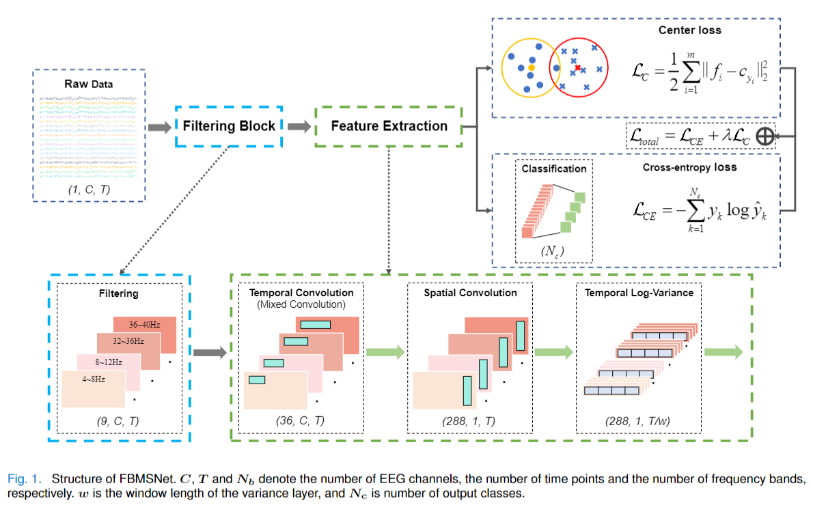
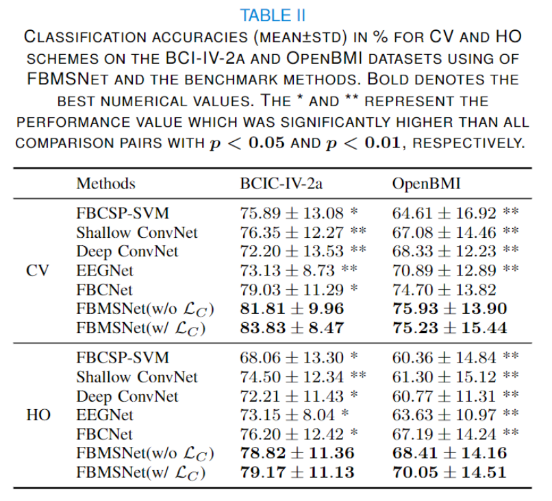

# FBMSNet

## FBMSNet: A Filter-Bank Multi-Scale Convolutional Neural Network for EEG-Based Motor Imagery Decoding

This is the PyTorch implementation of the FBMSNet architecture for EEG-MI classification. 

# FBMSNet: Architecture



FBMSNet consists of four blocks, (1) a temporal convolution block, (2) a spatial convolution block, (3) a temporal log-variance block, and (4) a fully connected layer for classification. The first block is designed to learn the multiscale temporal information from the multiview EEG representations, and the second block aims to learn the spatial information from each temporal feature map. Subsequently, the third block computes the temporal variance of each time series. Finally, all representations are flattened and fed to the fully connected layer with softmax as the activation function. An overview of FBMSNet is depicted in Fig. 1.

Furthermore, to distinguish similar categories in a better way and decrease the influence of interclass dispersion and within-class variance, we not only minimize the cross entropy (CE) loss function but also introduce the center loss function. With this joint supervision, FBMSNet is capable of learning deep features with two key learning objectives as much as possible, interclass separability and intraclass compactness as much as possible, which are crucial to MI recognition

## How to use
If you want to reproduce the experimental results reported in the paper, make sure you use the same runtime environment.

The package requirements to run all the codes are provided in file env.txt. The complete instructions for utilising this toolbox are provided in instructions.txt.

All the codes have been tested to work using a virtual environment mentioned in the env.txt file. 
1. Create a new virtual environment named "env_fbmsnet" with python3.7 using Anaconda3 and activate it：

```{
conda create --name env_fbmsnet python=3.7
conda activate env_fbmsnet
}```

3. Install virtualenv package:
```
conda install -c anaconda ujson=1.35
pip install -U scikit-learn
pip install pandas -i
pip install matplotlib
pip install torchsummary
pip install resampy
pip install seaborn
pip install pygame
pip install selenium
```

3. Change the current working path to the path where you have stored env.txt. Install required packages.
> E: 
> pip install -r env.txt

4. Download the offline installation files for torch and torchvision from the following link: https://download.pytorch.org/whl/torch_stable.html, Use the "Ctrl + F" command to search for the installation files of the specified version of torch and torchvision and download it. It is recommended to store them under the same path as env.txt.
torch version : torch-1.3.1-cp37-cp37m-win_amd64
torchvision version : torchvision-0.4.2-cp37-cp37m-win_amd64

5. When you have finished downloading, use the pip command to install them.
pip install torch-1.3.1-cp37-cp37m-win_amd64.whl
pip install torchvision-0.4.2-cp37-cp37m-win_amd64.whl

Congratulations, you have completed all the steps to create the virtual environment needed to run the source code!

## FBMSNet: Results

The classification results for FBMSNet and other competing architectures are as follows:



## Cite:
If you find this architecture or toolbox useful then please cite this paper:

*Liu, Ke and Yang, Mingzhao and Yu, Zhuliang and Wang, Guoyin and Wu, Wei. FBMSNet: A Filter-Bank Multi-Scale Convolutional Neural Network for EEG-Based Motor Imagery Decoding. IEEE Transactions on Biomedical Engineering, 70(2):436–445, 2023. https://ieeexplore.ieee.org/document/9837422*


## References:

*Ravikiran Mane, Effie Chew, Karen Chua, Kai Keng Ang, Neethu Robinson, A.P. Vinod, Seong-Whan Lee, and Cuntai Guan, **"FBCNet: An Efficient Multi-view Convolutional Neural Network for Brain-Computer Interface,"** arXiv preprint arXiv:2104.01233 (2021) https://arxiv.org/abs/2104.01233*

## Acknowledgment

We thank Ravikiran Mane et al. for their useful [toolbox](https://github.com/ravikiran-mane/FBCNet). 

